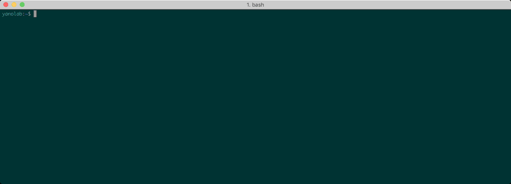

# ghls

ghls is a tool to display own github repositories written by golang.

## Installation

```
go get github.com/yanolab/ghls
```

## Usage

```
$ ghls -h
Usage of ghls:
  -cleancache
    	clean cache
  -disablecache
    	caching is disable
  -p string
    	print value by paramters
  -u	get and update repositories cache
  -user string
    	target user
```

## Usecases

Display the specific user repositories.
```
$ ghls -user golang -disablecache | head -n 5
golang/appengine
golang/arch
golang/benchmarks
golang/blog
golang/build
```

Display the specific user repositories with given names.
```
$ ghls -user golang -p stars,name -disablecache | sort -n -r | head -n 5
53212 go
11536 dep
7062 groupcache
4064 protobuf
3387 mobile
```

Combination with peco, fzf, hub.\
Finding a repository with a fuzzy search and open its browser.\
`$ ghls -user golang -p fullname,description -disablecache | fzf | awk '{print $1}' | xargs hub browse`
